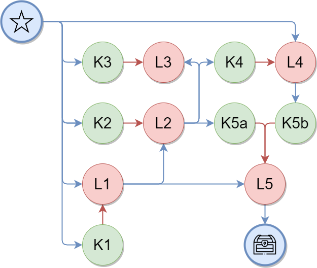

# Generation and visualization of the Explorio Dungeon logical layout

This is a PoC for the dungeon generation system for the Explorio game.
Main methodology used is Lock and Key system implemented with Graph grammars as well as Wave Function Collapse to specify concrete types of abstract elements.

## Working with the repo

### Create virtual environment

-   `python -m pip install venv`
-   `python -m venv env`

#### Windows

-   `env/Scripts/activate.ps1` for powershell
-   `env/Scripts/activate.bat` for cmd

#### Linux

-   `source env/bin/activate` in bash

### Install required packages

-   `python -m pip install -r requirements.txt`

### Run the example script to validate the environment

-   `python main.py`

### Run the tests

-   `python -m pytest`
